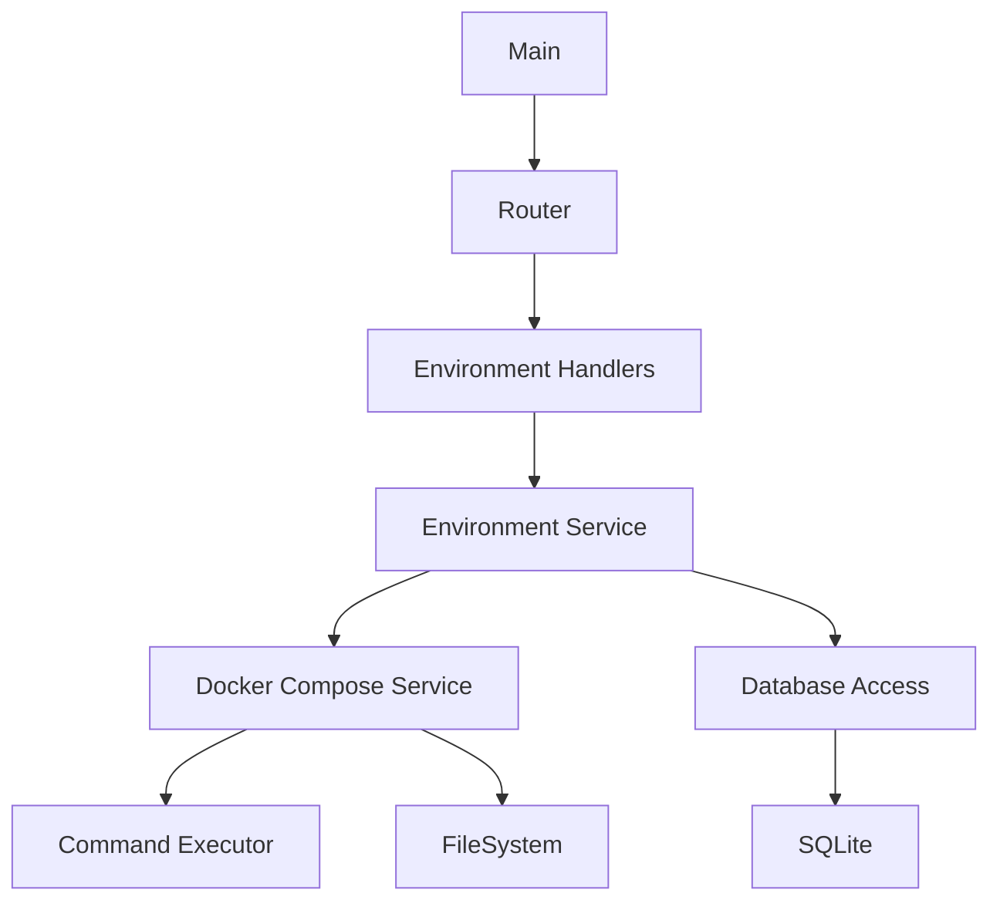

# PR Environment API Migration Plan: JavaScript to Go

This document outlines the comprehensive plan for migrating the PR Environment API from JavaScript (Node.js) to Go. The migration aims to leverage Go's strengths while maintaining the current functionality and improving overall performance, reliability, and maintainability.

## Table of Contents

1. [Advantages of Using Go](#advantages-of-using-go)
2. [Migration Architecture](#migration-architecture)
3. [Migration Plan](#migration-plan)
   - [Phase 1: Project Setup and Core Utilities](#phase-1-project-setup-and-core-utilities)
   - [Phase 2: Database Layer](#phase-2-database-layer)
   - [Phase 3: Services Layer](#phase-3-services-layer)
   - [Phase 4: API Layer](#phase-4-api-layer)
   - [Phase 5: Testing and Documentation](#phase-5-testing-and-documentation)
   - [Phase 6: Deployment and CI/CD](#phase-6-deployment-and-cicd)
4. [Detailed Component Mapping](#detailed-component-mapping)
5. [Implementation Timeline](#implementation-timeline)
6. [Migration Strategy](#migration-strategy)
7. [Code Examples](#code-examples)

## Advantages of Using Go

### 1. Performance

- **Compiled Language**: Go's compiled nature provides significantly better performance compared to Node.js's interpreted execution
- **Lower Memory Footprint**: Go applications typically use less memory than equivalent Node.js applications
- **Faster Startup Time**: Beneficial for containerized deployments and auto-scaling scenarios
- **Efficient Concurrency**: More efficient handling of concurrent requests through Go's goroutines

### 2. Type Safety

- **Static Typing**: Catches many errors at compile time rather than runtime
- **Improved Code Reliability**: Explicit type definitions lead to more reliable code
- **Reduced Runtime Errors**: Fewer unexpected type-related errors that are common in JavaScript
- **Better IDE Support**: Enhanced code completion and error detection during development

### 3. Dependency Management

- **Go Modules**: Robust dependency management with explicit versioning
- **Smaller Dependency Tree**: Less complex dependency management compared to Node.js ecosystem
- **Self-contained Binary**: No runtime dependencies required for deployment
- **Vendoring Support**: Option to vendor dependencies for complete reproducibility

### 4. Docker Integration

- **System Command Support**: Excellent support for executing system commands makes it well-suited for Docker operations
- **Smaller Container Images**: Single binary deployment leads to smaller container images
- **Resource Efficiency**: Better resource utilization in containerized environments
- **Cross-platform Support**: Easy to build for different target platforms

### 5. Concurrency Model

- **Goroutines**: Lightweight threads that enable efficient concurrent operations
- **Channels**: Type-safe communication between goroutines
- **Parallel Docker Operations**: Better handling of parallel Docker Compose operations
- **Improved Responsiveness**: Better performance under load with multiple concurrent requests

### 6. Deployment Simplicity

- **Single Binary**: Simple deployment with no runtime dependencies
- **Cross-compilation**: Built-in support for compiling to different platforms
- **Reduced Operational Complexity**: Fewer moving parts in production
- **Smaller Attack Surface**: Reduced security vulnerabilities due to fewer dependencies

## Migration Architecture

The proposed architecture for the Go implementation follows a clean, layered approach:



## Migration Plan

### Phase 1: Project Setup and Core Utilities

1. **Initialize Go Project**:
   - Set up Go modules with `go mod init github.com/vertuoza/pr-env-api`
   - Create a basic project structure following Go best practices
   - Set up configuration management using environment variables

2. **Implement Core Utilities**:
   - **Logger**: Use `zap` or `logrus` as a replacement for Winston
     - Support for structured logging
     - Multiple output formats (JSON, console)
     - Different log levels
   - **File System**: Implement file operations using Go's standard library
     - Directory creation and management
     - File reading and writing
     - Path manipulation
   - **Command Executor**: Create a wrapper for executing shell commands
     - Support for command execution with timeout
     - Proper error handling and logging
     - Stream handling for stdout and stderr
   - **Environment Config**: Port the environment configuration utilities
     - Environment ID generation
     - Directory path management
     - URL creation

### Phase 2: Database Layer

1. **Database Connection**:
   - Implement SQLite connection using `go-sqlite3` or `modernc.org/sqlite`
   - Create database initialization and migration functions
   - Implement connection pooling for efficient resource usage

2. **Data Models and Repositories**:
   - Define Go structs for environments and logs
   - Implement CRUD operations for environments and logs
   - Add transaction support for atomic operations
   - Implement query builders and filters

3. **Data Access Layer**:
   - Create repository interfaces for testability
   - Implement SQLite-specific repository implementations
   - Add support for database migrations

### Phase 3: Services Layer

1. **Docker Compose Service**:
   - Implement functions for managing Docker Compose environments
   - Port the PR environment setup, start, stop, and cleanup functionality
   - Add error handling and recovery mechanisms
   - Implement concurrent operations where appropriate

2. **Environment Service**:
   - Implement the business logic for environment management
   - Port the create, update, remove, get, and list functionality
   - Add validation and error handling
   - Implement service interfaces for testability

3. **Configuration Service**:
   - Implement environment file manipulation
   - Port the Docker Compose file update functionality
   - Add support for template-based configuration

### Phase 4: API Layer

1. **HTTP Router**:
   - Set up a router using `gin-gonic/gin` or `gorilla/mux`
   - Implement middleware for logging, error handling, etc.
   - Add request validation and sanitization
   - Implement CORS and security headers

2. **API Handlers**:
   - Implement handlers for all environment endpoints
   - Add request validation and error handling
   - Ensure API compatibility with the existing JavaScript implementation
   - Add proper HTTP status codes and response formats

3. **API Documentation**:
   - Implement Swagger/OpenAPI documentation
   - Add endpoint descriptions and examples
   - Document request and response formats

### Phase 5: Testing and Documentation

1. **Unit Tests**:
   - Write comprehensive unit tests for all components
   - Implement mocks for external dependencies
   - Add test coverage reporting

2. **Integration Tests**:
   - Implement integration tests for API endpoints
   - Add database integration tests
   - Create Docker Compose integration tests

3. **Documentation**:
   - Update API documentation
   - Add Go-specific setup instructions
   - Document any changes in behavior or configuration
   - Create developer guides for extending the application

### Phase 6: Deployment and CI/CD

1. **Containerization**:
   - Create a multi-stage Dockerfile for building and running the Go application
   - Optimize container size and security
   - Add health checks and graceful shutdown

2. **CI/CD Integration**:
   - Update GitHub Actions workflows for the Go application
   - Add automated testing and deployment
   - Implement version tagging and release management

3. **Monitoring and Observability**:
   - Add metrics collection
   - Implement structured logging
   - Add tracing support

## Detailed Component Mapping

### Main Package

```go
package main

import (
    "log"
    "os"

    "github.com/vertuoza/pr-env-api/config"
    "github.com/vertuoza/pr-env-api/database"
    "github.com/vertuoza/pr-env-api/router"
    "github.com/vertuoza/pr-env-api/utils/logger"
)

func main() {
    // Initialize logger
    logger.Setup()

    // Load configuration
    cfg, err := config.Load()
    if err != nil {
        logger.Error("Failed to load configuration", err)
        os.Exit(1)
    }

    // Initialize database
    db, err := database.Setup(cfg.DBPath)
    if err != nil {
        logger.Error("Failed to setup database", err)
        os.Exit(1)
    }
    defer db.Close()

    // Setup and start HTTP server
    r := router.Setup(db)
    logger.Info("PR Environment API Server running on port " + cfg.Port)
    if err := r.Run(":" + cfg.Port); err != nil {
        logger.Error("Failed to start server", err)
        os.Exit(1)
    }
}
```

### Database Package

```go
package database

import (
    "database/sql"
    "path/filepath"

    _ "github.com/mattn/go-sqlite3"
    "github.com/vertuoza/pr-env-api/utils/filesystem"
    "github.com/vertuoza/pr-env-api/utils/logger"
)

// Setup initializes the database connection and creates tables if they don't exist
func Setup(dbPath string) (*sql.DB, error) {
    // Ensure data directory exists
    dataDir := filepath.Dir(dbPath)
    if err := filesystem.EnsureDirectory(dataDir); err != nil {
        return nil, err
    }

    // Open database connection
    db, err := sql.Open("sqlite3", dbPath)
    if err != nil {
        return nil, err
    }

    // Create tables if they don't exist
    if err := createTables(db); err != nil {
        db.Close()
        return nil, err
    }

    logger.Info("Connected to the PR environments database")
    return db, nil
}

// createTables creates the necessary tables if they don't exist
func createTables(db *sql.DB) error {
    // Create environments table
    _, err := db.Exec(`
        CREATE TABLE IF NOT EXISTS environments (
            id TEXT PRIMARY KEY,
            repository_name TEXT NOT NULL,
            services_data TEXT NOT NULL,
            pr_number INTEGER NOT NULL,
            status TEXT NOT NULL,
            url TEXT NOT NULL,
            created_at DATETIME DEFAULT CURRENT_TIMESTAMP,
            updated_at DATETIME DEFAULT CURRENT_TIMESTAMP
        )
    `)
    if err != nil {
        return err
    }

    // Create environment_logs table
    _, err = db.Exec(`
        CREATE TABLE IF NOT EXISTS environment_logs (
            id INTEGER PRIMARY KEY AUTOINCREMENT,
            environment_id TEXT NOT NULL,
            action TEXT NOT NULL,
            status TEXT NOT NULL,
            message TEXT,
            created_at DATETIME DEFAULT CURRENT_TIMESTAMP,
            FOREIGN KEY (environment_id) REFERENCES environments (id)
        )
    `)
    if err != nil {
        return err
    }

    return nil
}
```

### Environment Model

```go
package models

import (
    "encoding/json"
    "time"
)

// Environment represents a PR environment
type Environment struct {
    ID            string    `json:"id"`
    RepositoryName string    `json:"repositoryName"`
    ServicesData  string    `json:"-"`
    Services      []Service `json:"services"`
    PRNumber      int       `json:"prNumber"`
    Status        string    `json:"status"`
    URL           string    `json:"url"`
    CreatedAt     time.Time `json:"createdAt"`
    UpdatedAt     time.Time `json:"updatedAt"`
}

// Service represents a service in a PR environment
type Service struct {
    Name     string `json:"name"`
    ImageURL string `json:"imageUrl"`
}

// UnmarshalServices parses the ServicesData JSON into the Services slice
func (e *Environment) UnmarshalServices() error {
    if e.ServicesData == "" {
        e.Services = []Service{}
        return nil
    }

    return json.Unmarshal([]byte(e.ServicesData), &e.Services)
}

// MarshalServices converts the Services slice to JSON and stores it in ServicesData
func (e *Environment) MarshalServices() error {
    data, err := json.Marshal(e.Services)
    if err != nil {
        return err
    }

    e.ServicesData = string(data)
    return nil
}
```

### Environment Repository

```go
package repositories

import (
    "database/sql"
    "time"

    "github.com/vertuoza/pr-env-api/models"
)

// EnvironmentRepository handles database operations for environments
type EnvironmentRepository struct {
    db *sql.DB
}

// NewEnvironmentRepository creates a new environment repository
func NewEnvironmentRepository(db *sql.DB) *EnvironmentRepository {
    return &EnvironmentRepository{db: db}
}

// Create inserts a new environment into the database
func (r *EnvironmentRepository) Create(env *models.Environment) error {
    // Marshal services to JSON
    if err := env.MarshalServices(); err != nil {
        return err
    }

    // Insert environment
    _, err := r.db.Exec(
        "INSERT INTO environments (id, repository_name, services_data, pr_number, status, url) VALUES (?, ?, ?, ?, ?, ?)",
        env.ID, env.RepositoryName, env.ServicesData, env.PRNumber, env.Status, env.URL,
    )
    return err
}

// Get retrieves an environment by ID
func (r *EnvironmentRepository) Get(id string) (*models.Environment, error) {
    env := &models.Environment{}

    err := r.db.QueryRow(
        "SELECT id, repository_name, services_data, pr_number, status, url, created_at, updated_at FROM environments WHERE id = ?",
        id,
    ).Scan(&env.ID, &env.RepositoryName, &env.ServicesData, &env.PRNumber, &env.Status, &env.URL, &env.CreatedAt, &env.UpdatedAt)

    if err != nil {
        return nil, err
    }

    // Unmarshal services from JSON
    if err := env.UnmarshalServices(); err != nil {
        return nil, err
    }

    return env, nil
}

// Update updates an existing environment
func (r *EnvironmentRepository) Update(env *models.Environment) error {
    // Marshal services to JSON
    if err := env.MarshalServices(); err != nil {
        return err
    }

    // Update environment
    _, err := r.db.Exec(
        "UPDATE environments SET repository_name = ?, services_data = ?, status = ?, updated_at = ? WHERE id = ?",
        env.RepositoryName, env.ServicesData, env.Status, time.Now(), env.ID,
    )
    return err
}

// List retrieves environments based on filters
func (r *EnvironmentRepository) List(filters map[string]interface{}) ([]*models.Environment, error) {
    // Build query with filters
    query := "SELECT id, repository_name, services_data, pr_number, status, url, created_at, updated_at FROM environments"
    args := []interface{}{}

    if len(filters) > 0 {
        query += " WHERE"
        first := true

        if status, ok := filters["status"].(string); ok {
            query += " status = ?"
            args = append(args, status)
            first = false
        }

        if prNumber, ok := filters["prNumber"].(int); ok {
            if !first {
                query += " AND"
            }
            query += " pr_number = ?"
            args = append(args, prNumber)
            first = false
        }

        if repoName, ok := filters["repositoryName"].(string); ok {
            if !first {
                query += " AND"
            }
            query += " repository_name = ?"
            args = append(args, repoName)
        }
    }

    query += " ORDER BY created_at DESC"

    // Execute query
    rows, err := r.db.Query(query, args...)
    if err != nil {
        return nil, err
    }
    defer rows.Close()

    // Parse results
    environments := []*models.Environment{}
    for rows.Next() {
        env := &models.Environment{}
        err := rows.Scan(&env.ID, &env.RepositoryName, &env.ServicesData, &env.PRNumber, &env.Status, &env.URL, &env.CreatedAt, &env.UpdatedAt)
        if err != nil {
            return nil, err
        }

        // Unmarshal services from JSON
        if err := env.UnmarshalServices(); err != nil {
            return nil, err
        }

        environments = append(environments, env)
    }

    return environments, nil
}
```

### Docker Compose Service

```go
package services

import (
    "path/filepath"

    "github.com/vertuoza/pr-env-api/utils/commandexecutor"
    "github.com/vertuoza/pr-env-api/utils/filesystem"
    "github.com/vertuoza/pr-env-api/utils/logger"
    "github.com/vertuoza/pr-env-api/config"
)

// DockerComposeService handles Docker Compose operations
type DockerComposeService struct {
    executor *commandexecutor.CommandExecutor
    fs       *filesystem.FileSystem
    config   *config.EnvironmentConfig
}

// NewDockerComposeService creates a new Docker Compose service
func NewDockerComposeService(
    executor *commandexecutor.CommandExecutor,
    fs *filesystem.FileSystem,
    config *config.EnvironmentConfig,
) *DockerComposeService {
    return &DockerComposeService{
        executor: executor,
        fs:       fs,
        config:   config,
    }
}

// SetupPrEnvironment copies and configures the vertuoza-compose folder for a PR environment
func (s *DockerComposeService) SetupPrEnvironment(repositoryName string, prNumber int, services []models.Service) (string, error) {
    // Create environment ID
    environmentID := s.config.CreateEnvironmentID(repositoryName, prNumber)

    // Create environment directory
    environmentDir := s.config.GetEnvironmentDir(environmentID)
    if err := s.fs.EnsureDirectory(environmentDir); err != nil {
        return "", err
    }

    // Path to the source vertuoza-compose folder
    sourceDir := filepath.Join("..", "vertuoza-compose")

    // Copy the entire vertuoza-compose folder contents to the environment directory
    if err := s.fs.CopyDirectory(sourceDir, environmentDir); err != nil {
        return "", err
    }

    // Update environment files with PR-specific configuration and services
    if err := s.config.UpdateEnvironmentFiles(environmentDir, repositoryName, prNumber, services); err != nil {
        return "", err
    }

    logger.Infof("Set up PR environment at %s with %d services", environmentDir, len(services))

    return environmentDir, nil
}

// StartEnvironment starts a Docker Compose environment
func (s *DockerComposeService) StartEnvironment(environmentDir string) error {
    cmd := fmt.Sprintf("cd %s && docker compose up -d", environmentDir)
    _, err := s.executor.Execute(cmd)
    if err != nil {
        return err
    }

    logger.Infof("Started Docker Compose environment at %s", environmentDir)
    return nil
}

// StopEnvironment stops and removes a Docker Compose environment
func (s *DockerComposeService) StopEnvironment(environmentDir string) error {
    cmd := fmt.Sprintf("cd %s && docker compose down -v --remove-orphans", environmentDir)
    _, err := s.executor.Execute(cmd)
    if err != nil {
        return err
    }

    // Clean up any dangling containers, images, and volumes
    _, err = s.executor.Execute("docker system prune -f")
    if err != nil {
        return err
    }

    logger.Infof("Stopped Docker Compose environment at %s", environmentDir)
    return nil
}

// CleanupEnvironment removes the environment directory
func (s *DockerComposeService) CleanupEnvironment(environmentDir string) error {
    if err := s.fs.Remove(environmentDir); err != nil {
        return err
    }

    logger.Infof("Cleaned up environment directory at %s", environmentDir)
    return nil
}
```

## Implementation Timeline

1. **Phase 1 (Core Utilities)**: 1-2 weeks
   - Project setup and configuration
   - Implementation of core utilities
   - Unit testing of utilities

2. **Phase 2 (Database Layer)**: 1-2 weeks
   - Database connection and initialization
   - Models and repositories implementation
   - Database integration testing

3. **Phase 3 (Services Layer)**: 2-3 weeks
   - Docker Compose service implementation
   - Environment service implementation
   - Service integration testing

4. **Phase 4 (API Layer)**: 1-2 weeks
   - Router and middleware setup
   - API handlers implementation
   - API documentation

5. **Phase 5 (Testing and Documentation)**: 1-2 weeks
   - Comprehensive testing
   - Documentation updates
   - Performance testing

6. **Phase 6 (Deployment and CI/CD)**: 1 week
   - Containerization
   - CI/CD pipeline setup
   - Monitoring and observability

Total estimated time: 7-12 weeks, depending on complexity and resource allocation.

## Migration Strategy

A parallel implementation approach is recommended:

1. **Develop in Parallel**: Build the Go version alongside the existing JavaScript version
   - Maintain feature parity
   - Implement comprehensive testing
   - Ensure API compatibility

2. **Staged Deployment**:
   - Deploy the Go version in a staging environment
   - Run both versions in parallel with traffic mirroring
   - Compare performance and behavior

3. **Gradual Transition**:
   - Start with non-critical environments
   - Gradually shift traffic to the Go version
   - Monitor for issues and performance

4. **Complete Migration**:
   - Once stability is confirmed, shift all traffic to Go version
   - Decommission the JavaScript version
   - Document the migration process and lessons learned

This approach minimizes risk and allows for a smooth transition without service disruption.

## Code Examples

### Configuration Loading

```go
package config

import (
    "os"
    "strconv"

    "github.com/joho/godotenv"
)

// Config holds the application configuration
type Config struct {
    Port            string
    Environment     string
    TailscaleDomain string
    TailscaleAuthKey string
    DBPath          string
    LogLevel        string
}

// Load loads the configuration from environment variables
func Load() (*Config, error) {
    // Load .env file if it exists
    godotenv.Load()

    // Get environment variables with defaults
    port := getEnv("PORT", "3000")
    environment := getEnv("NODE_ENV", "development")
    tailscaleDomain := getEnv("TAILSCALE_DOMAIN", "tailf31c84.ts.net")
    tailscaleAuthKey := getEnv("TAILSCALE_AUTH_KEY", "")
    dbPath := getEnv("DB_PATH", "./data/pr-environments.db")
    logLevel := getEnv("LOG_LEVEL", "info")

    return &Config{
        Port:            port,
        Environment:     environment,
        TailscaleDomain: tailscaleDomain,
        TailscaleAuthKey: tailscaleAuthKey,
        DBPath:          dbPath,
        LogLevel:        logLevel,
    }, nil
}

// getEnv gets an environment variable or returns a default value
func getEnv(key, defaultValue string) string {
    value := os.Getenv(key)
    if value == "" {
        return defaultValue
    }
    return value
}
```

### API Handler Example

```go
package handlers

import (
    "encoding/json"
    "net/http"
    "strconv"
    "strings"

    "github.com/gin-gonic/gin"
    "github.com/vertuoza/pr-env-api/models"
    "github.com/vertuoza/pr-env-api/services"
)

// EnvironmentHandler handles environment-related API requests
type EnvironmentHandler struct {
    service *services.EnvironmentService
}

// NewEnvironmentHandler creates a new environment handler
func NewEnvironmentHandler(service *services.EnvironmentService) *EnvironmentHandler {
    return &EnvironmentHandler{service: service}
}

// CreateEnvironment handles POST /api/environments
func (h *EnvironmentHandler) CreateEnvironment(c *gin.Context) {
    // Parse request body
    var req struct {
        RepositoryName string          `json:"repository_name"`
        PRNumber      int             `json:"pr_number"`
        Services      []models.Service `json:"services"`
    }

    if err := c.ShouldBindJSON(&req); err != nil {
        c.JSON(http.StatusBadRequest, gin.H{"error": err.Error()})
        return
    }

    // Validate required fields
    if req.RepositoryName == "" {
        c.JSON(http.StatusBadRequest, gin.H{"error": "repository_name is required"})
        return
    }

    if req.PRNumber == 0 {
        c.JSON(http.StatusBadRequest, gin.H{"error": "pr_number is required"})
        return
    }

    if len(req.Services) == 0 {
        c.JSON(http.StatusBadRequest, gin.H{"error": "At least one service is required"})
        return
    }

    // Validate each service
    for _, service := range req.Services {
        if service.Name == "" {
            c.JSON(http.StatusBadRequest, gin.H{"error": "Each service must have a name"})
            return
        }
        if service.ImageURL == "" {
            c.JSON(http.StatusBadRequest, gin.H{"error": "Each service must have an image_url"})
            return
        }
    }

    // Create environment
    env, err := h.service.CreateEnvironment(req.RepositoryName, req.PRNumber, req.Services)
    if err != nil {
        c.JSON(http.StatusInternalServerError, gin.H{"error": err.Error()})
        return
    }

    c.JSON(http.StatusCreated, env)
}

// GetEnvironment handles GET /api/environments/:id
func (h *EnvironmentHandler) GetEnvironment(c *gin.Context) {
    id := c.Param("id")

    // Get environment
    env, err := h.service.GetEnvironment(id)
    if err != nil {
        if strings.Contains(err.Error(), "not found") {
            c.JSON(http.StatusNotFound, gin.H{"error": err.Error()})
            return
        }
        c.JSON(http.StatusInternalServerError, gin.H{"error": err.Error()})
        return
    }

    c.JSON(http.StatusOK, env)
}

// ListEnvironments handles GET /api/environments
func (h *EnvironmentHandler) ListEnvironments(c *gin.Context) {
    // Parse query parameters
    status := c.Query("status")
    repositoryName := c.Query("repository_name")
    prNumberStr := c.Query("pr_number")

    // Build filters
    filters := make(map[string]interface{})

    if status != "" {
        filters["status"] = status
    }

    if repositoryName != "" {
        filters["repositoryName"] = repositoryName
    }

    if prNumberStr != "" {
        prNumber, err := strconv.Atoi(prNumberStr)
        if err == nil {
            filters["prNumber"] = prNumber
        }
    }

    // List environments
    environments, err := h.service.ListEnvironments(filters)
    if err != nil {
        c.JSON(http.StatusInternalServerError, gin.H{"error": err.Error()})
        return
    }

    c.JSON(http.StatusOK, gin.H{"environments": environments})
}
```

This migration plan provides a comprehensive roadmap for transitioning the PR Environment API from JavaScript to Go, leveraging Go's strengths while maintaining compatibility with the existing system.
